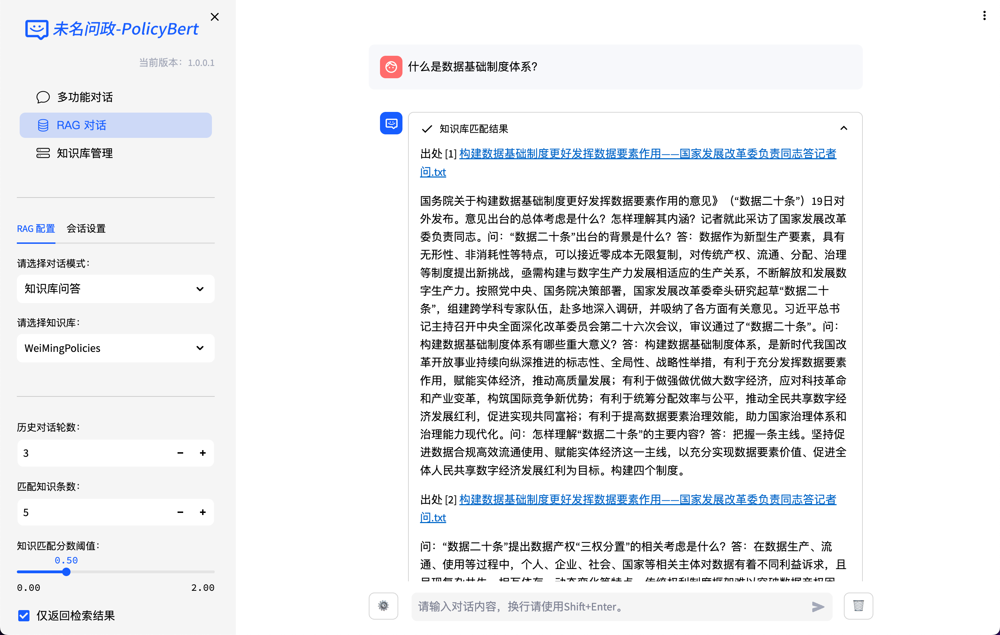
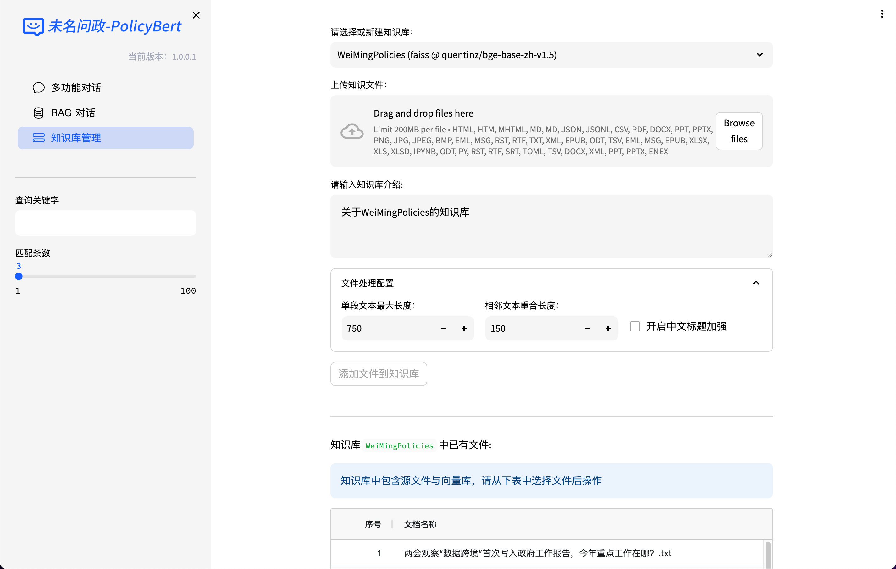
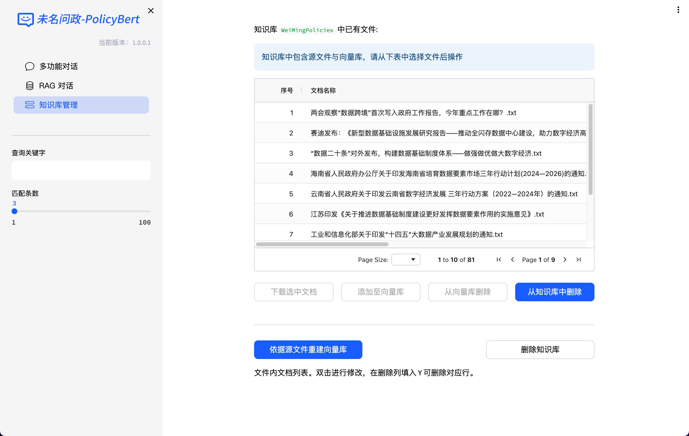

# 未名问政 RAG 系统

## 系统部署

未名问政 RAG 系统的部署过程相对简单，用户只需在本地安装必要的依赖库，并下载预训练模型与知识库数据。系统支持多种操作系统环境，包括 Windows、Linux 和 MacOS。用户可根据需求选择合适的运行环境，并通过命令行界面启动系统。系统的运行效率较高，能够在普通个人电脑上实现快速响应。

### 部署配置
- **操作系统**：Windows 10  
- **CPU**：Intel Core i9-14900HX  
- **内存**：32 GB  
- **显卡**：NVIDIA GeForce RTX 4060 8GB  
- **Python 版本**：3.9.6  

### 部署步骤
1. **配置 Ollama 环境**  
   下载 Ollama 并通过以下代码部署千问模型（Qwen2.5:7b）和微调过的 `bge-base-zh-v1.5` 模型：
   ```bash
   # 下载千问模型
   ollama pull qwen2.5:7b

   # 部署微调模型
   ollama add bge-base-zh-v1.5 path/to/your/model

   # 启动 Ollama 服务
   ollama serve
   ```

2. **克隆未名问政系统代码**  
   ```bash
   git clone https://github.com/PuHT4213/WeiMingPolicyRAG.git
   cd WeiMingPolicyRAG/lib/chatchat-server
   ```

3. **创建虚拟环境并安装依赖**  
   ```bash
   python3.9 -m venv weimingpolicyrag
   source weimingpolicyrag/bin/activate # Linux/MacOS
   weimingpolicyrag\Scripts\activate # Windows
   pip install -e .
   ```

4. **初始化并启动系统**  
   确保政策文件位于 `./libs/chatchat-server/chatchat/data/knowledge_base/WeiMingPolicies/content` 目录下，然后运行以下命令：
   ```bash
   chatchat kb -r
   chatchat start -a
   ```

5. **启动成功日志示例**  
   ```bash
   -----------------------------------------------------------
   知识库名称      ：WeiMingPolicies
   知识库类型      ：faiss
   向量模型        ：bge-large-zh-v1.5
   知识库路径      ：path/to/your/knowledge_base
   文件总数量      ：99
   入库文件数      ：99
   知识条目数      ：740
   用时            ：0:02:29.701002
   -----------------------------------------------------------
   总计用时        ：0:02:33.414425
   ```

---

## RAG 对话

### 系统界面
未名问政 RAG 系统的主界面简洁直观，当前版本为 `1.0.0.1`。界面左侧设有功能导航栏，用户可在“多功能对话”、“RAG 对话”与“知识库管理”等主要模块间进行切换。

- **参数配置**：
  - 对话模式：支持“知识库问答”。
  - 历史对话轮数：默认为 3 轮。
  - 匹配知识条数：默认为 5 条。
  - 知识匹配分数阈值：范围为 `0.00` 至 `2.00`，默认值为 `0.50`。

- **交互方式**：
  - 用户可通过输入框输入问题，按 `Shift+Enter` 提交。
  - 勾选“仅返回检索结果”选项可查看未融合生成的原始检索片段。

### 示例界面
#### 系统首页


#### 检索结果界面


---

## 知识库管理

未名问政 RAG 系统的知识库管理模块允许用户对知识库进行增删改查操作。

- **功能**：
  - 上传知识文件：添加新的政策文本片段。
  - 编辑与删除：更新或移除已有知识。
  - 查看知识：快速浏览当前知识库中的所有条目。

### 示例界面
#### 上传知识文件


#### 查看知识


